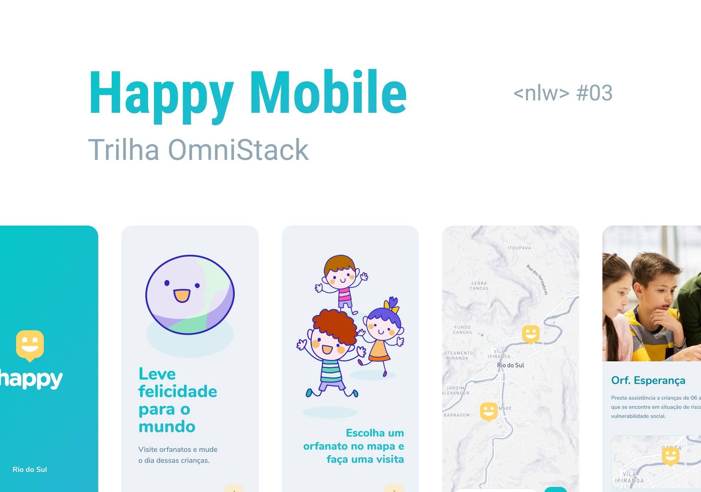

# Happy

[](LICENSE)

<h1 align="center">
  
</h1>


## 📌 Index

- [Sobre o projeto](#-sobre-o-projeto)
- [Screenshots](#-screenshots)
- [Techs](#-techs)
- [Instalação e Start](#-instalação-e-start)
- [Contribuições](#-contribuições)
- [License](#-license)


## ❔ Sobre o projeto

Uma plataforma para facilitar o encontro de orfanatos por pessoas que querem visita-los.

O projeto está em desenvolvimento na [Next Level Week 3](https://nextlevelweek.com/episodios/omnistack/1/edicao/3)


## 📸 Screenshots

<p align="center">
  <strong>Tela Web</strong> <br />
  
    <strong>Tela Mobile</strong> <br />
  
</p>

## 🛠 Techs

- **Web**
  - [React](https://reactjs.org/)
  - [Typescript](https://www.typescriptlang.org/)
  - [Leaflet](https://leafletjs.com/)
  - [React Leaflet](https://react-leaflet.js.org/)
  - [Open Street Map](https://www.openstreetmap.org/) ou [Mapbox](https://www.mapbox.com/)
  - [Framer Motion](https://www.framer.com/motion/)

- **Backend**
  - [Nodejs](https://nodejs.org/en/)
  - [Express](https://expressjs.com/) 
  - [Typeorm](https://typeorm.io/)
  - [Multer](https://github.com/expressjs/multer)
  - [Yup](https://github.com/jquense/yup)


## ⚙ Instalação e Start

Este repositório é um monorepo, portanto, manterá os fontes do projeto **Web**, **API** e **Mobile**. Cada parte do projeto tem suas dependências e é necessário instala-las individualmente antes da execução, para isso certifique-se de que tenha [NPM](https://www.npmjs.com/) ou [YARN](https://yarnpkg.com/) instalado em seu ambiente, além, é claro, o repositório clonado em seu ambiente.

Clone o repositório com:

```bash
> git clone https://github.com/tatucloud/happy.git
```

As demonstrações utilizam **YARN** por padronização, mas, caso use **NPM**, basta substituir onde estiver escrito `yarn` por `npm`.

**Instalando dependências do projeto web:**

```bash
> cd happy/web
> yarn install
```

Para executar o projeto **web**, use no diretório correspondente:

```bash
> yarn start
```

Acesse: [`http://127.0.0.1:3000/`](http://127.0.0.1:3000/) para visualizar.


**Instalando dependências do projeto backend:**

```bash
> cd happy/backend
> yarn install
```

Para executar o projeto **backend** é necessário criar o banco de dados com todas as tabelas utilizadas, para isso, use no diretório correspondente:

```bash
> yarn typeorm migration:run
> yarn dev
```

Para executar o projeto **mobile** é necessário criar o banco de dados com todas as tabelas utilizadas, para isso, use no diretório correspondente:

```bash
> yarn start
```
## 📜 License

O projeto está sobre a licença [MIT](./LICENSE) ❤️ 

Gostou? Deixe uma estrelinha para ajudar o projeto ⭐
